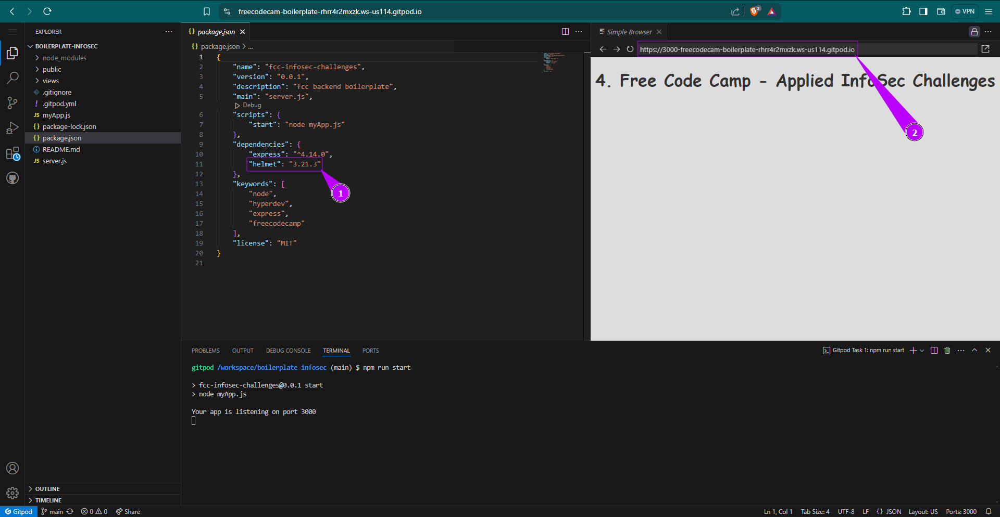
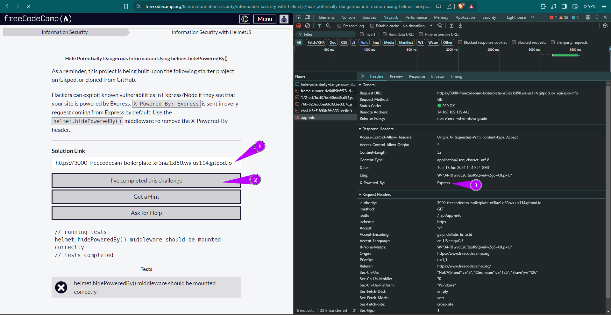
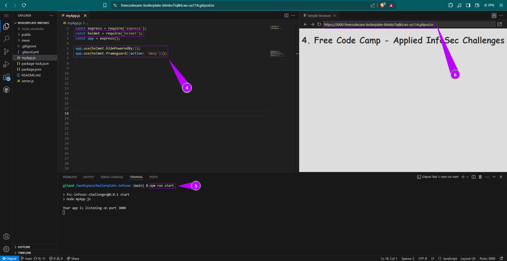

# [Information Security](https://www.freecodecamp.org/learn/information-security/)
learning Information Security with code camp

## Information Security with HelmetJS

- HelmetJS is a tool for Express-based web apps.
- It helps secure your site by setting HTTP headers automatically.
- This prevents sensitive information from being shared accidentally.
- It helps protecting your website from attacks.

Note: I use Gitpod to complete the tasks

### ⚫ [Install and Require Helmet](https://www.freecodecamp.org/learn/information-security/information-security-with-helmetjs/install-and-require-helmet)

**Solution**

1. Open your package.json file, locate the dependencies section, and add or update the Helmet entry to specify version 3.21.3.

2. Submit the link.

### ⚫ [Hide Potentially Dangerous Information Using helmet.hidePoweredBy()](https://www.freecodecamp.org/learn/information-security/information-security-with-helmetjs/hide-potentially-dangerous-information-using-helmet-hidepoweredby)

**Solution**

1. Start the project on Gitpod, and copy and paste the simple browser link

2. click on submit on challenge

3. Right-click to enter inspect mode, go to Network > app-info > Headers > X-Powered-By: Express. Let's solve this issue. 

4. Add this code to hide the dangerous information.

5. Run `npm run start`

6. Submit the link.

### ⚫ [Mitigate the Risk of Clickjacking with helmet.frameguard()](https://www.freecodecamp.org/learn/information-security/information-security-with-helmetjs/mitigate-the-risk-of-clickjacking-with-helmet-frameguard)

**Solution**

### ⚫ [Mitigate the Risk of Cross Site Scripting (XSS) Attacks with helmet.xssFilter()](https://www.freecodecamp.org/learn/information-security/information-security-with-helmetjs/mitigate-the-risk-of-cross-site-scripting-xss-attacks-with-helmet-xssfilter)

**Solution**

### ⚫ [Avoid Inferring the Response MIME Type with helmet.noSniff()](https://www.freecodecamp.org/learn/information-security/information-security-with-helmetjs/avoid-inferring-the-response-mime-type-with-helmet-nosniff)

**Solution**

### ⚫ [Prevent IE from Opening Untrusted HTML with helmet.ieNoOpen()](https://www.freecodecamp.org/learn/information-security/information-security-with-helmetjs/prevent-ie-from-opening-untrusted-html-with-helmet-ienoopen)

**Solution**

### ⚫ [Ask Browsers to Access Your Site via HTTPS Only with helmet.hsts()](https://www.freecodecamp.org/learn/information-security/information-security-with-helmetjs/ask-browsers-to-access-your-site-via-https-only-with-helmet-hsts)

**Solution**

### ⚫ [Disable DNS Prefetching with helmet.dnsPrefetchControl()](https://www.freecodecamp.org/learn/information-security/information-security-with-helmetjs/disable-dns-prefetching-with-helmet-dnsprefetchcontrol)

**Solution**

### ⚫ [Disable Client-Side Caching with helmet.noCache()](https://www.freecodecamp.org/learn/information-security/information-security-with-helmetjs/disable-client-side-caching-with-helmet-nocache)

**Solution**

### ⚫ [Set a Content Security Policy with helmet.contentSecurityPolicy()](https://www.freecodecamp.org/learn/information-security/information-security-with-helmetjs/set-a-content-security-policy-with-helmet-contentsecuritypolicy)

**Solution**

### ⚫ [Configure Helmet Using the ‘parent’ helmet() Middleware](https://www.freecodecamp.org/learn/information-security/information-security-with-helmetjs/configure-helmet-using-the-parent-helmet-middleware)

**Solution**

### ⚫ [Understand BCrypt Hashes](https://www.freecodecamp.org/learn/information-security/information-security-with-helmetjs/understand-bcrypt-hashes)

**Solution**

### ⚫ [Hash and Compare Passwords Asynchronously](https://www.freecodecamp.org/learn/information-security/information-security-with-helmetjs/hash-and-compare-passwords-asynchronously)

**Solution**

### ⚫ [Hash and Compare Passwords Synchronously](https://www.freecodecamp.org/learn/information-security/information-security-with-helmetjs/hash-and-compare-passwords-synchronously)

**Solution**

### ⚫ 

**Solution**